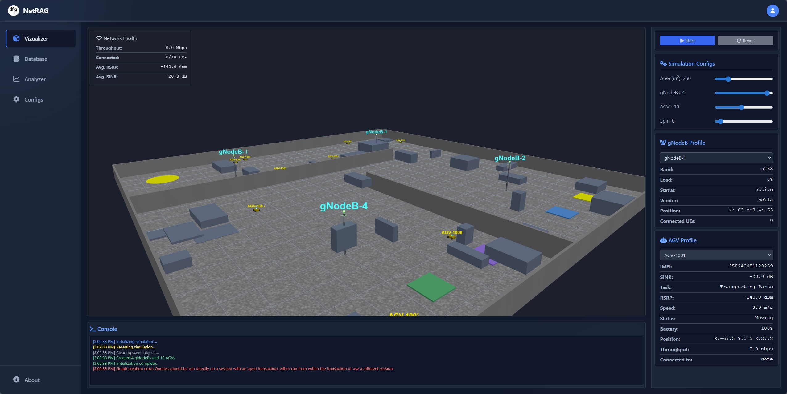

# NetRAG 5G/6G

## Overview
This project simulates 5G/6G networks in a 3D environment along with a retrieval-augmented generation framework for reasoning. The simulation includes base stations, user equipment, and environmental obstructions.

## Layout
Below is the layout of the simulation environment:

## Features
- Dynamic beamforming optimization using AI.
- Real-time simulation of UEs movement and signal obstructions.
- Visualization of base station coverage and antenna patterns.

## Getting Started
1. Clone the repository.
2. create a .env file with the following code

NEO4J_USER=neo4jdb
NEO4J_PASS=password
NEO4J_URI=bolt://localhost:7687

GEMINI_MODEL="gemini-2.0-flash"
GEMINI_API="Your google API key"

3. Install dependencies: npm install
4. Run the simulation: npm start

## License
This project is licensed under the Apache License.